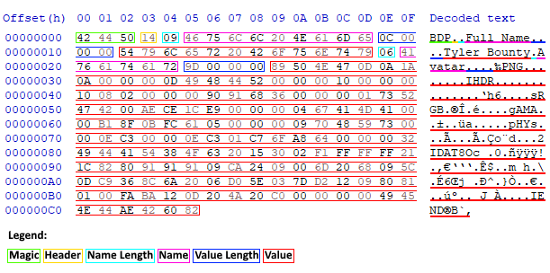

<p align="center">
  
</p>

# About <a href="https://en.wikipedia.org/wiki/C%2B%2B17"></a>
**BDP** (_Binary Data Package_) is a basic 64 bit packaging format for binary data.

This is a cross-platform C++17 implementation of BDP.

# BDP Format

BDP packages store _name-value_ pairs, where the name and the value contain binary data.

The maximum size of the names and values is determined by the package _header_.

> BDP is a **64 bit** format (_i.e. the maximum possible size of a name/value is **2^64 - 1**_).
>
> However, package names and values can be stored with an **8, 16, 32 or 64 bit** format.
>
> The name/value bit size is specified in the package _header_.

## Augmented BNF (ABNF) notation

The most common BDP package type is **BDP832** (meaning **8 bits** for the name length & **32 bits** for the value length).

This is the ABNF notation for BDP832 (see below [package types](https://github.com/UnexomWid/BDP#complete-table-of-package-types)).

```abnf
BDP         = Magic Header *Entry

Magic       = %s"BDP"
Header      = %x14       ; depends on the package type

Entry       = NameEntry ValueEntry

NameEntry   = NameLength Name
ValueEntry  = ValueLength Value

NameLength  = 1(%x00-FF) ; 1, 2, 4 or 8, depending on the name byte size
Name        = *(%x00-FF)

ValueLength = 4(%x00-FF) ; 1, 2, 4 or 8, depending on the value byte size
Value       = *(%x00-FF)
```

For other BDP package types, the `Header`, `NameLength` and `Value` rules vary.

This repository contains ABNF notations for every package type [here](https://github.com/UnexomWid/BDP/tree/master/grammar).

## Magic value

All BDP packages begin with the magic value `BDP`. If this value is missing, the package is marked as invalid.

The magic value is **24 bits** (**3 bytes**) long.

## Header

The header is stored after the magic value, and it is **8 bits** (**1 byte**) long. It contains the _name_ and _value_ **bit sizes**.

The first 4 bits from right to left determine the _value_ bit size, and the last 4 bits  determine the _name_ bit size. Each 4-bit group contains **exactly** 1 bit equal to `1`.

The bit size is determined based on the position of the bit which is equal to `1`, as follows:

* _Position 0:_ **8 bit** (_max 255_)
* _Position 1:_ **16 bit** (_max 65 535_)
* _Position 2:_ **32 bit** (_max 4 294 967 295_)
* _Position 3:_ **64 bit** (_max 18 446 744 073 709 551 615_)

Depending on the bit sizes, BDP packages can be classified into _16 types_, with the rule `BDP[NBS][VBS]`, where:

* **[NBS]** = _name bit size_
* **[VBS]** = _value bit size_

### Complete table of package types

| Package Type | Name Bit Size | Value Bit Size | Header   | ABNF Header Rule |
|--------------|---------------|----------------|----------|:----------------:|
| BDP88        | 8             | 8              | 00010001 |       %x11       |
| BDP816       | 8             | 16             | 00010010 |       %x12       |
| BDP832       | 8             | 32             | 00010100 |       %x14       |
| BDP864       | 8             | 64             | 00011000 |       %x18       |
| BDP168       | 16            | 8              | 00100001 |       %x21       |
| BDP1616      | 16            | 16             | 00100010 |       %x22       |
| BDP1632      | 16            | 32             | 00100100 |       %x24       |
| BDP1664      | 16            | 64             | 00101000 |       %x28       |
| BDP328       | 32            | 8              | 01000001 |       %x41       |
| BDP3216      | 32            | 16             | 01000010 |       %x42       |
| BDP3232      | 32            | 32             | 01000100 |       %x44       |
| BDP3264      | 32            | 64             | 01001000 |       %x48       |
| BDP648       | 64            | 8              | 10000001 |       %x81       |
| BDP6416      | 64            | 16             | 10000010 |       %x82       |
| BDP6432      | 64            | 32             | 10000100 |       %x84       |
| BDP6464      | 64            | 64             | 10001000 |       %x88       |

## Name-Value Pairs

The _name-value_ pairs are stored after the header, or after the previous pair, as follows:

`[name_bytes_length][name_bytes][value_bytes_length][value_bytes]`

The length of the name/value is stored in **exactly** `bitSize / 8` bytes (_e.g. if the name bit size is 16, the length of the name will be stored in **exactly 2 bytes**, even if 1 byte is enough_).

Therefore, the maximum length of a single name/value is `2^bitSize - 1`.

## Example

This is an arbitrary **BDP832** package which contains information about a user (_2 name-value pairs_):

* The full name of the user
* The avatar of the user (_16x16 PNG_)

> Name Bit Size: **8**
>
> Value Bit Size: **32**

<p align="center">
   
</p>

# Documentation

The code documentation for this implementation can be found [here](https://github.com/UnexomWid/BDP/tree/master/docs).

# Releases

>Note: versions with the suffix **R** are considered stable releases, while those with the suffix **D** are considered unstable.

[v0.1.0D](https://github.com/UnexomWid/BDP/releases/tag/v0.1.0D) - May 2nd, 2020

# License <a href="https://github.com/UnexomWid/BDP/blob/master/LICENSE"></a>
The BDP format was created by [UnexomWid](https://uw.exom.dev). This format, along with this C++ implementation, is licensed under the [MIT](https://github.com/UnexomWid/BDP/blob/master/LICENSE) license.
